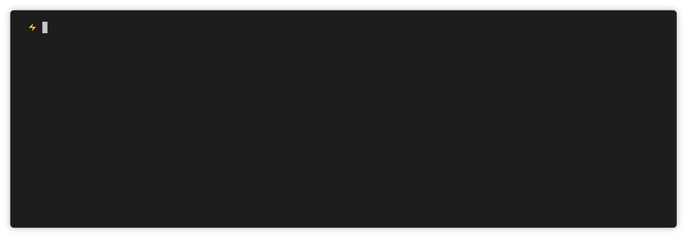

<div align="center">
    
</div>

<h1 align="center">Beau</h1>
<p align="center">Testing JSON APIs made easy.</p>
<p align="center">
    <a href="https://codeclimate.com/github/Seich/Beau/maintainability"></a>
    <a href="https://codeclimate.com/github/Seich/Beau/test_coverage"></a>
    
</p>

## What is Beau?

Beau is a modern http client. It uses a YAML file as configuration allowing you
to test APIs without having to write lengthy commands.

<div align="center">
    
</div>

## Installation

    npm install -g beau

## Usage

    $ beau [COMMAND]

    COMMANDS
      help      display help for beau
      list      Lists all available requests in the config file.
      request   Executes a request by name.
      validate  Validates the given configuration file against Beau's configuration schema.

## Example Configuration File

```yaml
endpoint: https://httpbin.org/

POST /anything:
    alias: anything
    payload:
      hello: world
```

```
$ beau request anything

Status              Endpoint
200                 https://httpbin.org/anything

{
...
  json: {
    hello: "world"
  },
  method: "POST",
  url: "https://httpbin.org/anything"
  ...
}
```

## Documentation

Visit https://beaujs.com/docs/ for the complete docs.

## License

Copyright 2018 David Sergio Díaz

Permission is hereby granted, free of charge, to any person obtaining a copy of
this software and associated documentation files (the "Software"), to deal in
the Software without restriction, including without limitation the rights to
use, copy, modify, merge, publish, distribute, sublicense, and/or sell copies of
the Software, and to permit persons to whom the Software is furnished to do so,
subject to the following conditions:

The above copyright notice and this permission notice shall be included in all
copies or substantial portions of the Software.

THE SOFTWARE IS PROVIDED "AS IS", WITHOUT WARRANTY OF ANY KIND, EXPRESS OR
IMPLIED, INCLUDING BUT NOT LIMITED TO THE WARRANTIES OF MERCHANTABILITY, FITNESS
FOR A PARTICULAR PURPOSE AND NONINFRINGEMENT. IN NO EVENT SHALL THE AUTHORS OR
COPYRIGHT HOLDERS BE LIABLE FOR ANY CLAIM, DAMAGES OR OTHER LIABILITY, WHETHER
IN AN ACTION OF CONTRACT, TORT OR OTHERWISE, ARISING FROM, OUT OF OR IN
CONNECTION WITH THE SOFTWARE OR THE USE OR OTHER DEALINGS IN THE SOFTWARE.
